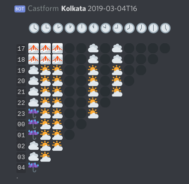

# discord-bot-castform

This is a bot that, given some location, queries AccuWeather and converts it into in-game weather forecasts for Pokémon GO.

In the distant past of 2018 Pokémon GO used to pull the forecasts from AccuWeather at predictable times of the day. We could reliably predict the in-game weather by just running those hours through our various models. But that's no longer the case, so the bot now scans every hour and reports all the forecasts for the next twelve hours like so:



<sub>Look, Discord Flavored Markdown doesn't do tables. This is the best I can do. The most recent forecast is the leftmost column of emoji, and the rightmost column is the earliest. Naturally, the further into the future you go, the fewer forecasts are available, forming this nice triangle. And those black orbs are forecasts where no data is available for whatever reason.</sub>

Now, since I can't afford to get a commercial AW key to serve the entire planet, I've built this solely for personal use. Feel free to run your own instance though :D

## Install

This is a Node.js project. It also makes of of a lot of ES2015+ so use at least Node 10.x I myself will always be on the latest unstable.

Consider using [pnpm](http://pnpm.js.org) to fetch dependencies since that's what I use myself, and Glitch.com does too.

## Configure

The bot uses two config files, template versions of which are included in the repository and named `template.*.json`. Duplicate them and remove the `template.` bits from the filenames to make the instance read them.

### Locations

The locations are configured in the `location.json` file.

It should be pretty self-explanatory from the placeholder config for Kolkata: An object where the keys are shorthand names for the weather supercells you want to query, with longer names defined within the value object alongside the essential AccuWeather location ID, API Key, timezone, when to pull forecasts every hour, and an optional custom model name.

You can get the AccuWeather location ID for your location by simply visiting your desired area from a browser and copying the id, like so:

```
https://www.accuweather.com/en/in/kolkata/206690/weather-forecast/206690
                                  -area-- --ID--                  --ID--
```

In my city the weather cells are definitely level 10 S2 cells.

### AccuWeather API Key

You'll need at least _one_ from [AccuWeather APIs](https://developer.accuweather.com).

A free one will do, unless you add far too many locations and run out of your daily limit of 50 calls.

You'd need to set this as part of your location in `locations.json`.

### Discord Bot Setup

Similarly, you'd need to define your Discord bot's secret in `config.json`.

A placeholder file is included, and only has one field so it should be pretty simple to start with. Eventually though, this file will store configs from servers that use your bot.

The bot needs at least the following permissions number: `19520`

You can refer to [An Idiot's Guide](https://anidiots.guide/) for more information. No, that's not me calling _you_ one, I didn't write the guide :D

### Data Storage

By default the bot will save all forecast data pulled from AccuWeather to dist under the `data/aw/<location>/` folders. And if you specified a custom model for your location, it'll save converted in-game predictions too, even though this information can also be directly derived from the AW data alone.

The AW data is needed used to compile reports from past forecasts every hour. If you want to delete these files, make sure to leave at least the last two days.

## Usage

### Set Forecast Channel

Just @mention the bot with a channel:

`@Castform setChannel #weather`
  
Make sure it gets write and embed access to that channel, ofc.

Bear in mind that only one active channel possible per server for now. 
